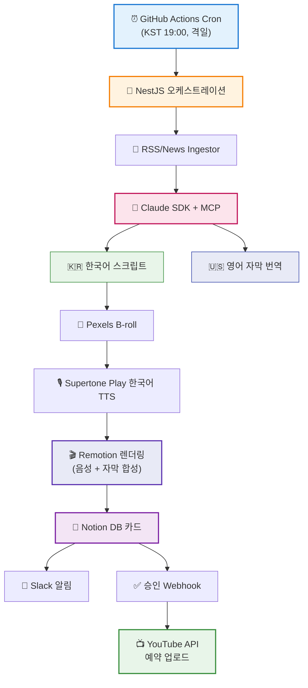

# Layer Studio
 
> Claude Agent SDK 기반 YouTube 쇼츠 자동 생성 파이프라인
 
AI 분석 채널과 K-Beauty 과학 채널, 영어권 글로벌 시청자 대상 두 개 채널을 자동화하는 풀스택 프로젝트입니다.
**한국어 음성 + 영어 자막** 전략으로 K-컬처 프리미엄을 활용합니다.
 

 
---
 
## 🎯 프로젝트 개요
 
Layer Studio는 YouTube 쇼츠 제작의 전 과정을 자동화하는 프로덕션 레벨의 콘텐츠 파이프라인입니다.
 
- 📰 **뉴스 큐레이션** — 한국 및 글로벌 테크/뷰티 소스에서 최신 뉴스 수집
- ✍️ **이중 언어 스크립트 생성** — Claude Sonnet이 한국어 스크립트와 영어 자막 동시 작성
- 🎙️ **한국어 음성 합성** — Supertone Play로 한국어 나레이션 생성 (서울대 음성 AI 연구진 개발, 한국어 TTS 품질 1위급)
- 📝 **영어 자막 생성** — 단어 단위 타임스탬프와 매칭된 영어 자막
- 🎬 **영상 합성** — 9:16 세로 포맷, 스톡 B-roll + 한국어 음성 + 영어 자막
- 📤 **자동 업로드** — 두 YouTube 채널에 자동 배포
**결과:** 약 7분의 자동 처리로 프로덕션 퀄리티의 쇼츠 1편 완성. 사용자 승인은 Notion 대시보드에서 1-2분.
 
---
 
## 🌏 콘텐츠 전략
 
### "한국인 오리지널, 글로벌 도달"
 
기존의 "한국인이 영어로 말하는 채널"과 차별화됩니다. **K-pop, K-drama, K-beauty**처럼 **한국어 원본 + 글로벌 자막** 전략을 활용합니다.
 
**왜 이 전략인가:**
- 🇰🇷 **진정성** — 한국인이 한국어로 말하는 게 가장 자연스러움
- 🌍 **K-컬처 프리미엄** — 글로벌 K-콘텐츠 열풍 활용
- 🎯 **차별화** — "미국 채널 모방" 방식과 완전 대비
- 📈 **지속성** — YouTube AI 탐지 정책에 안전
### 벤치마크
 
- **Maangchi** (700만 구독) — 한국 요리, 한국어 + 영어
- **이연의 갤러리** — 한국어 그림, 글로벌 팬
- **Korean Englishman** — 한영 혼합, 글로벌 브랜드
---
 
## 📺 운영 채널
 
| 채널 | 주제 | 핸들 |
|---------|-------|--------|
| **Layer AI Studio** | 한국 개발자가 보는 AI 인사이트 | [@LayerAIStudio](https://youtube.com/@LayerAIStudio) |
| **Layer Skin Studio** | K-Beauty insider의 성분 과학 해독 | [@LayerSkinStudio](https://youtube.com/@LayerSkinStudio) |
 
두 채널 모두:
- 🎤 **한국어 음성** (Supertone Play 보이스 클로닝 또는 직접 녹음)
- 📝 **영어 자막** (자동 생성 + 수동 검수)
- 📱 **9:16 세로 faceless 쇼츠**
- 🌐 **글로벌 영어권 타겟**
- 📅 업로드 주기: 각 채널 이틀에 한 번
---
 
## 🏗️ 시스템 아키텍처
 

 
---
 
## 🛠️ 기술 스택
 
### 핵심 스택
- **백엔드:** NestJS + TypeScript
- **데이터베이스:** PostgreSQL + Prisma
- **AI 오케스트레이션:** Claude Agent SDK + Model Context Protocol (MCP)
- **스크립트 생성:** Claude Sonnet (한국어 + 영어 번역) & Haiku (큐레이션)
- **음성 합성:** Supertone Play API — 한국어 TTS 특화 (보이스 클로닝 지원, 한국 크리에이터 업계 표준)
- **영상 합성:** Remotion (React 기반)
- **B-roll 수급:** Pexels API
### 인프라
- **스케줄링:** GitHub Actions (cron)
- **승인 워크플로:** Notion API
- **알림:** Slack Webhooks
- **스토리지:** AWS S3
- **배포:** Railway (예정)
### 음성 합성을 Supertone Play로 선정한 이유
 
- 🇰🇷 **한국어 품질 1위급** — 서울대 음성 AI 연구진 개발, 받침·연음·존댓말 체계 자연스럽게 처리
- 🎬 **한국 쇼츠 크리에이터 업계 표준** — 7600만뷰 썰 유튜버 등 대형 채널에서 실사용
- 🎙️ **15초 보이스 클로닝** — 최소 녹음으로 내 목소리 TTS 구현 가능
- 🌐 **크로스링구얼** — 한국어 녹음 한 번으로 한/영/일 콘텐츠 제작 가능 (추후 영어 나레이션 채널 확장 시 재활용)
- 🔌 **공식 API 제공** — 자동화 파이프라인 통합에 적합
> ElevenLabs도 후보였으나, 한국어 발음이 "외국인이 한국어 읽는 듯"한 어색함이 있어 한국어 원본 콘텐츠 전략과 맞지 않음.
 
---
 
## 🎬 콘텐츠 파이프라인
 
격일 기준 한국 시간 오후 7시에 실행:
 
1. **뉴스 수집** — RSS 피드에서 최근 48시간 기사 수집 (한국 + 글로벌)
2. **주제 선정** — Haiku가 채널별로 최적 주제 1개 선별
3. **한국어 스크립트 작성** — Sonnet이 140-160자 한국어 스크립트 생성
4. **영어 자막 번역** — Sonnet이 자연스러운 영어 자막 번역 (단어별 매칭 가능한 구조)
5. **B-roll 매칭** — Pexels API로 각 키워드에 맞는 9:16 세로 영상 수급
6. **음성 합성** — Supertone Play API로 한국어 나레이션 + 단어 단위 타임스탬프 생성
7. **영상 렌더링** — Remotion으로 영상 + 한국어 음성 + 영어 자막 합성
8. **알림** — Notion 카드 생성 + Slack 푸시
9. **사용자 승인** — 1-2분 내 Notion 체크박스로 승인
10. **예약 업로드** — YouTube Data API로 다음날 오전 7시 자동 공개
업로드된 영상은 한국 시간 오전 7시에 공개됩니다. 이는 미국 동부 시간 전날 오후 6시로, 영어권 시청 피크 타임입니다.
 
---
 
## 📚 문서
 
- [CLAUDE.md](./CLAUDE.md) — Claude Code를 위한 개발 가이드라인
- [docs/SPEC.md](./docs/SPEC.md) — 상세 기술 스펙
- [docs/WORKFLOW.md](./docs/WORKFLOW.md) — 파이프라인 워크플로 상세
- [docs/CONTENT.md](./docs/CONTENT.md) — 콘텐츠 가이드라인 및 프롬프트
- [docs/SETUP.md](./docs/SETUP.md) — 개발 환경 설정 가이드
---
 
## 🚧 개발 현황
 
**활발히 개발 중 — 2026년 4월**
 
로드맵:
- [x] 브랜드 아이덴티티 및 채널 셋업
- [x] 프로젝트 아키텍처 설계
- [x] 콘텐츠 전략 확정 (한국어 음성 + 영어 자막)
- [x] 문서화
- [ ] NestJS 백엔드 스캐폴딩
- [ ] Claude Agent SDK 통합
- [ ] 콘텐츠 도구용 MCP 서버
- [ ] Remotion 영상 템플릿 (한국어 음성 + 영어 자막)
- [ ] Supertone Play 한국어 음성 복제 셋업
- [ ] Pexels B-roll 통합
- [ ] YouTube Data API 통합
- [ ] Notion 승인 워크플로
- [ ] 첫 파이프라인 엔드투엔드 테스트
- [ ] 프로덕션 배포
---
 
## 💡 프로젝트 배경
 
기존 제가 개발한 [skindit](https://skindit-web.vercel.app) 프로젝트의 경험을 확장한 프로젝트입니다.
 
skindit에서 구축한 Claude Agent SDK, MCP 서버, RAG 하이브리드 검색 경험을 바탕으로, 이번에는 **완전 자동화된 콘텐츠 파이프라인**에 도전합니다. 단순히 AI를 호출하는 게 아니라, 에이전트가 여러 도구를 연쇄적으로 사용하는 **실제 프로덕션 규모의 Agentic 워크플로**를 구현하는 것이 목표입니다.
 
### 왜 이 콘텐츠 전략인가
 
**"한국인 오리지널 + 영어 자막" 전략의 본질:**
 
일반적인 접근 — 한국인이 영어로 말하는 채널 — 은 이미 포화 상태입니다. Layer Studio는 반대로 접근합니다.
 
- 🎨 **내가 가장 잘할 수 있는 것** — 한국어로 한국 시장 내부자 관점 전달
- 🌊 **시장 트렌드 활용** — K-뷰티, K-팝, K-드라마의 글로벌 확산
- 🛡️ **AI 탐지 회피** — YouTube의 강화된 AI 콘텐츠 정책에 안전
- 🔑 **차별화** — "진짜 한국인의 한국어 콘텐츠"라는 희소성
### 왜 두 개 채널인가
 
AI 분야와 K-Beauty 분야를 함께 다루는 이유는:
- 🧪 **두 분야 모두 "성분 해체"가 핵심** — AI 기술을 뜯어보는 것과 화장품 성분을 분석하는 것은 동일한 접근법입니다
- 🎯 **동일한 파이프라인으로 두 영역 커버** — 채널별 프롬프트만 분리하면 전체 인프라 재활용 가능
- 💼 **같은 "Wisely/Layer Studio" 브랜드의 두 축** — skindit과 시너지
---
 
## 👤 제작자
 
**김지혜 (Jihye)** — AI 엔지니어링과 콘텐츠 크리에이션의 교차점을 탐구하는 한국 개발자.
 
- **skindit** — AI 기반 화장품 성분 분석 서비스 ([skindit-web.vercel.app](https://skindit-web.vercel.app))
- **기술 블로그** — [velog.io/@wisely](https://velog.io/@wisely)
- **GitHub** — [@imjane72-lab](https://github.com/imjane72-lab)
---
 
## 📜 라이선스
 
MIT © 2026 Jihye
 
